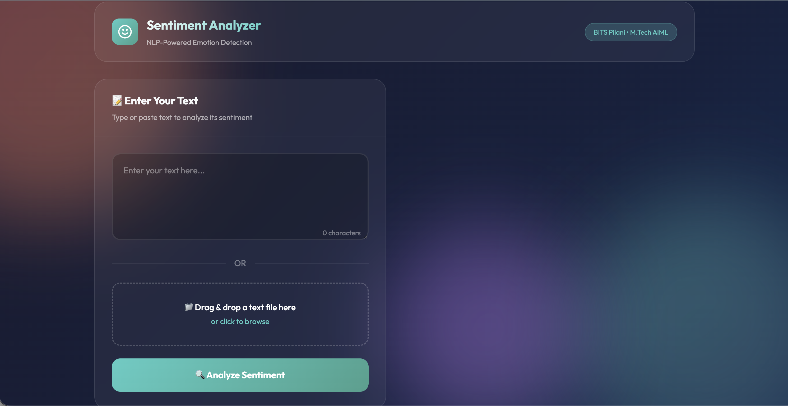
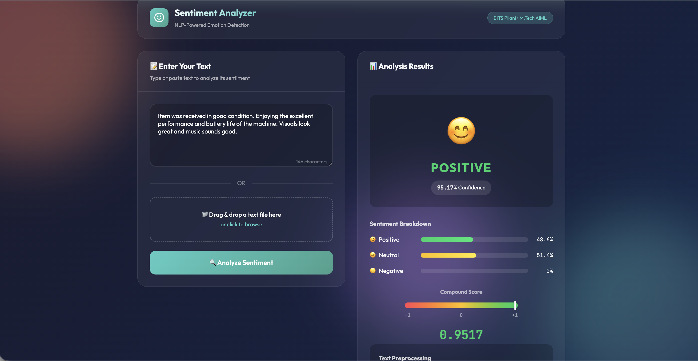
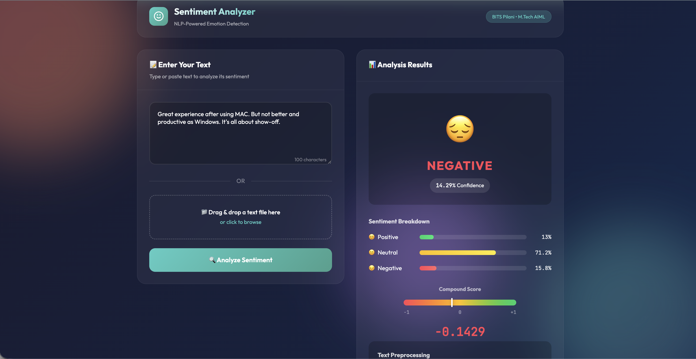
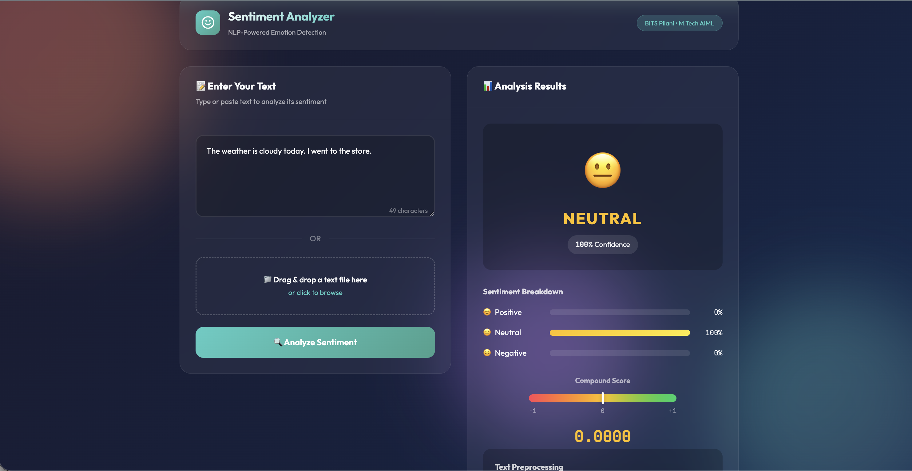
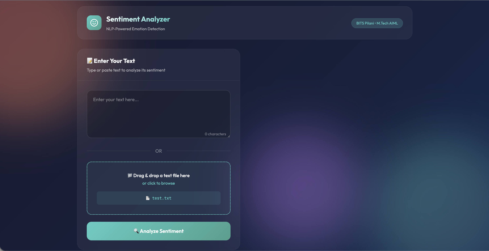
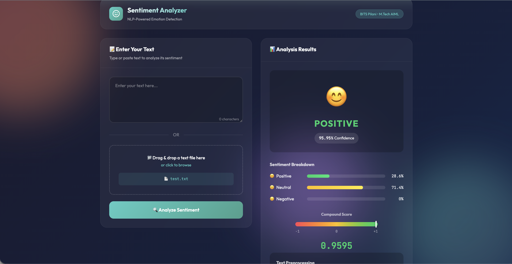

# Sentiment Analysis Application

## Overview
A Python web application that analyzes sentiment (positive, negative, neutral) from user-provided text using NLP techniques.

## Features
- Text input and file upload support
- Sentiment classification with confidence score
- Bar chart and gauge visualization
- Text preprocessing with tokenization, stemming, and lemmatization
- Sentence-by-sentence analysis

## Tech Stack
- **Python** with Flask
- **NLTK** (VADER Sentiment Analyzer)
- **HTML/CSS/JavaScript** for frontend

## Setup & Run

### Step 1: Install Dependencies
```bash
pip install -r requirements.txt
```

### Step 2: Run the App
```bash
python app.py
```

### Step 3: Open Browser
Go to http://localhost:5001

## Project Structure
```
Sentiment-Analyzer/
├── app.py                    # Main Flask application
├── requirements.txt          # Dependencies
├── test.txt 
├── README.md                 
├── Design_Report.md          # Design choices & challenges
├── Literature_Survey.pdf     # Healthcare sentiment analysis survey
├── Task_B_Enhancement_Plan.pdf # Chatbot integration plan
├── templates/
│   └── index.html
├── static/
│   ├── css/style.css
│   └── js/app.js
└── screenshots/
    └── (application screenshots)
```

## Application Screenshots

### 1. Home Page

*Main interface with text input and file upload options*

### 2. Positive Sentiment Analysis

*Result showing positive sentiment detection with green indicator*

### 3. Negative Sentiment Analysis

*Result showing negative sentiment detection with red indicator*

### 4. Neutral Sentiment Analysis

*Result showing neutral sentiment detection with yellow indicator*

### 5. File Upload Feature

*Uploading a text file for analysis*

### 6. File Analysis Result

*Sentiment analysis result from uploaded file*

### 7. Text Preprocessing

*Shows tokenization, lemmatization, and stemming output*

### 8. Sentence-by-Sentence Analysis

*Individual sentiment analysis for each sentence*

## How It Works

1. **Input**: Enter text or upload a .txt file
2. **Preprocessing**: 
   - Text cleaning (remove URLs, HTML)
   - Tokenization
   - Stopword removal
   - Lemmatization and Stemming
3. **Analysis**: VADER sentiment scoring
4. **Output**: Sentiment label, confidence score, bar charts, and sentence breakdown

## Repository

GitHub: [https://github.com/JharwalSapna/Sentiment-Analyzer](https://github.com/JharwalSapna/Sentiment-Analyzer)
